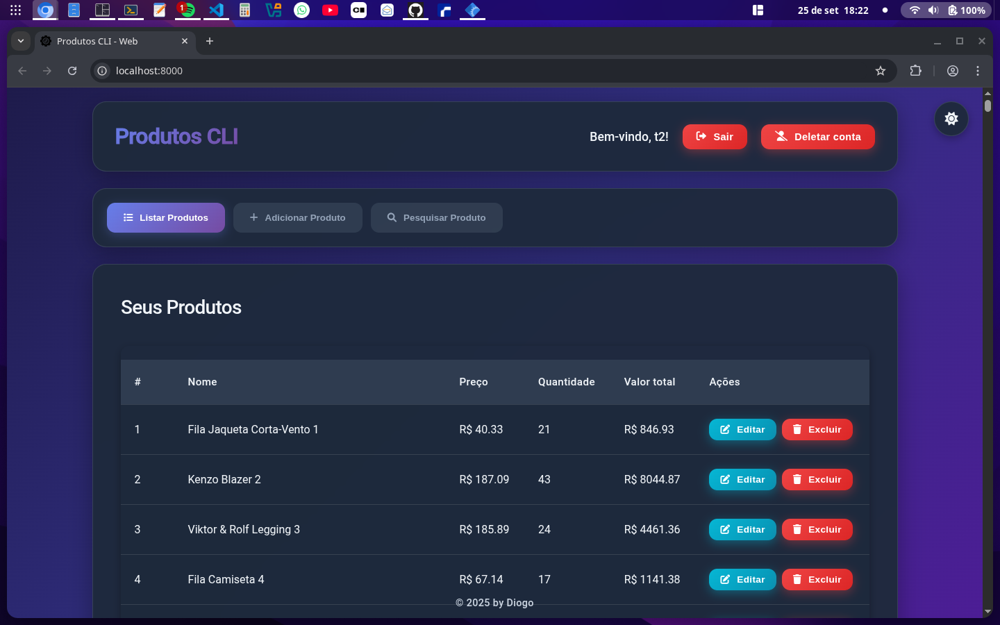

# 🌐 Produtos-CLI-Web

Este repositório contém a **parte web** do projeto [Produtos-CLI](https://github.com/diogopython/Servidor-produtosAPI-TS), oferecendo uma interface simples e prática para gerenciamento de produtos.

---

## 🚀 Funcionalidades

- 🔑 **Login**
- 📝 **Registro de usuário**
- 💾 **Login automático via credencial salva no navegador**
- ➕ **Adicionar produtos**
- ❌ **Remover produtos**
- 🚪 **Logout**
- 🗑️ **Apagar conta**

---

## 🛠️ Tecnologias

- **HTML5**
- **CSS3**
- **JavaScript (Vanilla JS)**

---

## 📦 Como usar

1. Clone este repositório:
   ```bash
   git clone https://github.com/diogopython/Produtos-CLI-Web.git
   ```

2. Entrar no diretorio:
    ```bash
    cd Produtos-CLI-Web
    ```

3. Abrir o projeto:
    - Pode ser aberto pelo navegador carregando o index.html ou abrir um servidor web na sua maquina (exemplo em python abaixo):
    - ```bash
      python3 -m http.server -d . 80
      ```

---
# Imagem

- **Images do projeto**
- 